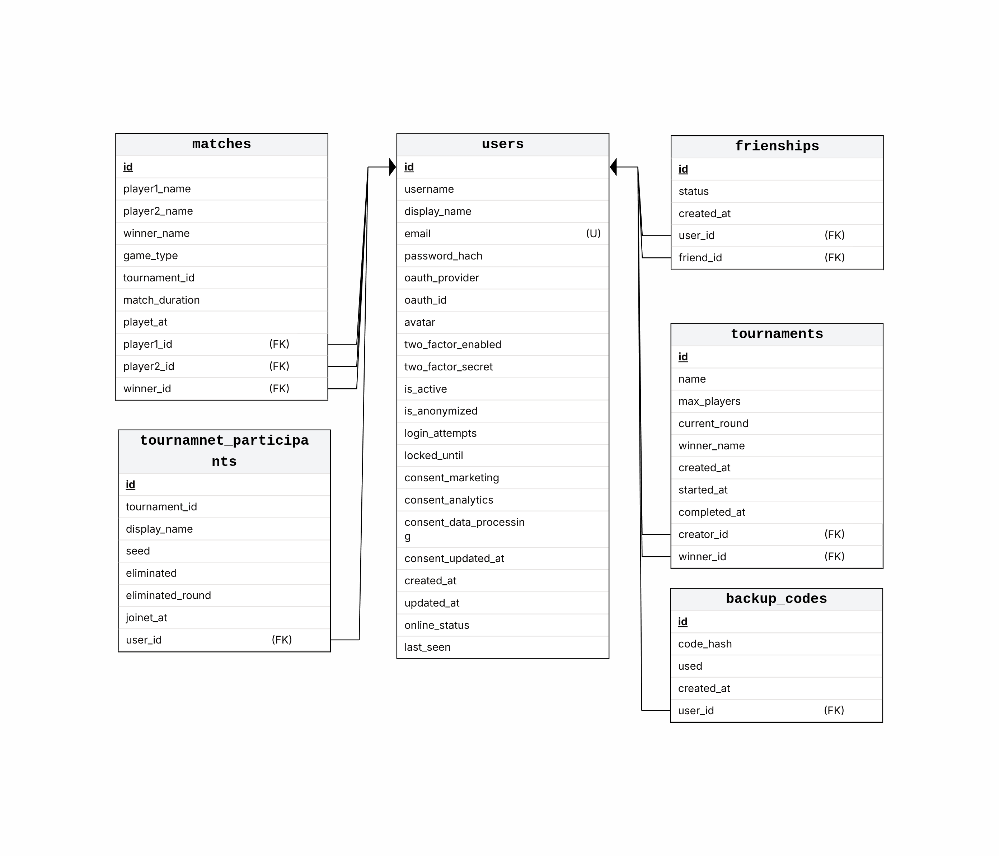

*This project has been created as part of the 42 curriculum by csubires, joestrad, lcuevas-, pausanch.*

# Description

**ft_transcendence** is the final coding project in the 42 common cursus. It serves as proof of a complete skillset from the team, demonstrating both hard technical skills and soft skills like teamwork.

Transcendence is a full-stack project. The goal is to automate the deployment of an entire server with a service-oriented architecture, accessible through a standard web browser. This requires building a frontend, backend, and database, all orchestrated to work together with a single command (`make`).

The project uses a Makefile to orchestrate Docker Compose, launching multiple containers that each encapsulate a part of the project. Each container is mostly independent and includes all necessary dependencies.

Our implementation is a games platform where users can play Pong and other games, register accounts, and view their game history. The system uses a microservices architecture and includes robust cybersecurity features to protect the backend and database from potential attacks originating from the frontend.

# Instructions

## Prerequisites

- **Make**: Ensure you have GNU Make installed to run the Makefile.
- **Docker**: Required to build and run the containers.
- **Docker Compose**: Used by the Makefile to orchestrate the multi-container setup.
- **.env**: An .env file is required in the root directory to configure OAuth authentication.

For detailed instructions on how to configure the .env file for OAuth, see [docs/oauth-guide.md](docs/oauth-guide.md).

To run this project, simply execute `make` in the root directory. This command will automatically build and start all required services using Docker Compose.

Once the setup is complete, open your web browser (the project is designed for Google Chrome) and navigate to https://localhost:8443.

From there, you will be able to access the main page, where you can register a new account, log in, play games, and explore the available features through intuitive menus.

# Resources

## Classic References
- [SQLite Documentation](https://www.sqlite.org/docs.html)
- [Database Design Basics (Microsoft)](https://learn.microsoft.com/en-us/office/troubleshoot/access/database-design-basics)
- [SQL Tutorial (W3Schools)](https://www.w3schools.com/sql/)

- [Docker Documentation](https://docs.docker.com/)
- [Node.js Documentation](https://nodejs.org/en/docs/)
- [MDN Web Docs (HTML, CSS, JS)](https://developer.mozilla.org/)
- [OWASP Top Ten Security Risks](https://owasp.org/www-project-top-ten/)

- [Microservices Architecture Pattern](https://microservices.io/patterns/microservices.html)
- [Docker Compose for Microservices](https://docs.docker.com/compose/)

- [Fastify Documentation](https://www.fastify.io/docs/latest/)
- [TypeScript Documentation](https://www.typescriptlang.org/docs/)
- [Tailwind CSS Documentation](https://tailwindcss.com/docs)
- [NGINX Documentation](https://nginx.org/en/docs/)
- [ModSecurity Handbook](https://www.modsecurity.org/documentation.html)
- [JWT (JSON Web Token) Introduction](https://jwt.io/introduction)
- [Web Application Firewall (WAF) Overview](https://owasp.org/www-community/Web_Application_Firewall)
- [i18next Documentation (Internationalization)](https://www.i18next.com/)

- [Vault by HashiCorp Documentation](https://developer.hashicorp.com/vault/docs)

- [Fetch API (MDN)](https://developer.mozilla.org/en-US/docs/Web/API/Fetch_API)
- [Fastify Multipart Plugin](https://www.fastify.io/docs/latest/Reference/Multipart/)
- [Axios Documentation](https://axios-http.com/docs/intro)

### Project Modules and Containers

- **auth**: Handles authentication, 2FA, and user security.
- **base**: Core logic and shared utilities.
- **database**: Manages user data, matches, and persistent storage.
- **frontend**: User interface, game logic, and client-side features (TypeScript, Tailwind CSS).
- **gateway**: API gateway and routing.
- **i18n**: Internationalization and language support.
- **nginx**: Reverse proxy, load balancing, and WAF (with ModSecurity). Serves static frontend files.
- **shared**: Shared configuration and code.
- **vault**: Secrets management and secure storage.

### System Architecture

The architecture followed by the system is shown in the next diagram:


					┌──────────────┐
					│     User     │
					└──────┬───────┘
   						   │
		 			 ┌─────▼─────┐
 					 │ Frontend  │
 					 └─────┬─────┘
       			  		   │ 
 					 ┌─────▼─────┐
 					 │  Gateway  │
	 		 		 └─────┬─────┘
		  ┌─────────┬──────┼──────┬──────────┐
		  ▼ 		▼ 	   ▼ 	  ▼ 	     ▼
		 Auth 	Database  I18n   Game 	  Friends
		  │ 			
		  ▼ 
		Vault 

## AI Usage

AI tools (such as GitHub Copilot and ChatGPT) were primarily used to help understand and document code written by other team members, as well as to assist in modifying and extending existing modules.

Additionally, AI was used in a limited way for code generation, documentation review, and troubleshooting errors
when starting with new tools and tech stacks.

No AI models were integrated into the production code or user-facing features.


# Team Information

**csubires**  
Roles: Technical Lead, Developer  
Responsibilities:
- Lead cybersecurity development
- Code reviews for development updates
- Reviews of microservices structure

**joestrad**  
Roles: Developer  
Responsibilities:
- Frontend development and refinement
- Main developer for the tournament module
- Testing and documentation reviews

**lcuevas-**  
Roles: Project Manager (PM), Developer  
Responsibilities:
- Organizes meetings and tracks weekly progress
- Coordinates team communication, versioning, and decision-making
- Implements features and final product versions
- Develops containerization and microservices deployment
- Main developer for user management and database modules

**pausanch**  
Roles: Product Owner (PO), Developer  
Responsibilities:
- Initial project schematization
- Lead developer for frontend and games modules
- Testing and documentation reviews

All members participate in code reviews, testing, and documentation. Roles overlapped as needed throughout module development.

# Project Management

## Organization
In the first phase, we held weekly meetings to distribute tasks. This stage focused on investigating the technologies needed to complete the modules and establishing a basic structure, which would later be improved and refined from mock-up builds. Each week, we met to discuss challenges, review how the modules interacted, and present the general structure and tools being used, as well as those intended for the final production version.
During this stage, every member chose their preferred modules, and we agreed on task distribution accordingly.

In the second stage, we concentrated on continuous development, fleshing out the modules. We shifted to a more remote approach, with team members regularly updating each other on their progress and pushing changes to the repositories. Every update to the development branch required a code review from another team member. If an update needed extra explanation, we would meet as necessary.


## Tools Used
Project management tools:
	- Git and GitHub for version control, code reviews, and collaboration.
	- Pen and paper for brainstorming, sketching schemas, and planning.
	- Canva and online flowchart tools for creating diagrams of project containers, services, and database structure.
	- No formal project management software was used; most coordination was handled directly through GitHub and informal discussions.

## Communication
Communication channels:
  - WhatsApp for informal personal updates and organizing meetings.
  - Slack for technical discussions and sharing small documents.
  - GitHub for project collaboration and code reviews.

# Technical Stack

## Frontend
**Languages:** TypeScript is used for development, and code is transpiled to JavaScript for browser compatibility.

**CSS Framework:** Tailwind CSS is used for styling and layout, providing utility-first classes.

**HTTP Requests:** The Fetch API is used for client-server communication, including image uploads. Axios may be used in some modules, but Fetch is the main method.

**Build Tools:** Node.js is used for development and build processes (transpiling, bundling), but not for running frontend code in the browser.

**Code Organization:** The frontend is modular,code is organized in TypeScript modules and pages.

**Other Libraries:** If needed, multipart handling and Axios are used for specific tasks (e.g., image upload), but most network operations use Fetch.

## Backend
**Languages:** JavaScript (Node.js) is used for backend development.

**Frameworks:** Fastify is used as the main web framework for building APIs and handling HTTP requests.

**Authentication:** JWT (JSON Web Token) is used for secure authentication and authorization. Two-factor authentication (2FA) is implemented for additional security.

**Microservices:** The backend is organized into microservices structure, each running in its own Docker container.

**Security:** ModSecurity (via NGINX) is used as a Web Application Firewall (WAF) to protect against common web vulnerabilities.

**Database Integration:** SQLite is used for persistent storage, managed through dedicated backend modules.

**Internationalization:** i18n provides localization and language support for backend responses.

**Secrets Management:** Vault is used for secure storage and management of sensitive data.

**Other Libraries:**
- Passport & @fastify/passport: For authentication strategies and user session management.
- bcrypt: For secure password hashing.
- jsonwebtoken: For JWT creation and validation.
- axios: For making special HTTP requests between services.
- @fastify/multipart, busboy, form-data: For file uploads and form data handling.
- speakeasy: For implementing two-factor authentication (TOTP).
- qrcode: For generating QR codes (e.g., for 2FA setup).
- @fastify/cookie, @fastify/secure-session: For cookie and session management.
- @fastify/cors: For enabling CORS in APIs.
- @fastify/formbody: For parsing form data in requests.
- @fastify/static: For serving static files.
- Additional libraries are used for validation and other backend tasks.

## Database
**System Used:** SQLite is used as the main database. It was chosen because it is lightweight, easy to manage, and well-suited for projects with simple tables, small data volumes, and straightforward queries.

**Image Storage:** In addition to the main relational database, a separate storage volume is managed within the database module specifically for storing user-uploaded images. This keeps binary data outside the main database and allows for efficient file management.

## Other Technologies
- Any other significant technologies or libraries.
- Justification for major technical choices.

# Database Schema

## Tables and Relationships

The database consists of 6 interconnected tables:

**Visual diagram available**: See `_assets/database_schema.png` for a graphical representation.



### Text Representation

```
users (PK: id)
  │
  ├──→ backup_codes (FK: user_id → users.id)
  │    └── Stores 2FA backup codes
  │
  ├──→ friendships (FK: user_id → users.id, friend_id → users.id)
  │    └── Manages friend relationships between users
  │
  ├──→ tournaments (FK: creator_id → users.id, winner_id → users.id)
  │    │
  │    ├──→ tournament_participants (FK: tournament_id → tournaments.id, user_id → users.id)
  │    │    └── Links users to tournaments
  │    │
  │    └──→ matches (FK: tournament_id → tournaments.id)
  │         └── Tournament games
  │
  └──→ matches (FK: player1_id → users.id, player2_id → users.id, winner_id → users.id)
       └── Records all game matches (casual and tournament)
```

## Table Structures

### 1. users
```
PRIMARY KEY: id (TEXT)
UNIQUE: email, (oauth_provider, oauth_id)

Columns:
  id                      TEXT      - Unique user identifier
  username                TEXT      - User's login name
  display_name            TEXT      - Public display name
  email                   TEXT      - User email (unique)
  password_hash           TEXT      - Hashed password
  oauth_provider          TEXT      - OAuth provider (google, github, 42)
  oauth_id                TEXT      - OAuth user ID
  avatar                  TEXT      - Avatar file path
  two_factor_enabled      BOOLEAN   - 2FA activation status
  two_factor_secret       TEXT      - TOTP secret for 2FA
  is_active               BOOLEAN   - Account active status
  is_anonymized           BOOLEAN   - GDPR anonymization flag
  login_attempts          INTEGER   - Failed login counter
  locked_until            DATETIME  - Account lock expiration
  consent_marketing       BOOLEAN   - Marketing consent
  consent_analytics       BOOLEAN   - Analytics consent
  consent_data_processing BOOLEAN   - Data processing consent
  consent_updated_at      DATETIME  - Last consent update
  created_at              DATETIME  - Account creation timestamp
  updated_at              DATETIME  - Last update timestamp
  online_status           TEXT      - Current status (online/offline)
  last_seen               DATETIME  - Last activity timestamp

Note: Game statistics (wins, losses, games_played, win_rate) are calculated 
dynamically from the matches table, not stored in users table.
```

### 2. backup_codes
```
PRIMARY KEY: id (INTEGER, auto-increment)
FOREIGN KEY: user_id → users(id) [CASCADE DELETE]

Columns:
  id         INTEGER   - Auto-incrementing ID
  user_id    TEXT      - Reference to users table
  code_hash  TEXT      - Hashed backup code
  used       BOOLEAN   - Whether code has been used
  created_at DATETIME  - Code generation timestamp
```

### 3. friendships
```
PRIMARY KEY: id (INTEGER, auto-increment)
FOREIGN KEYS: user_id → users(id) [CASCADE DELETE]
              friend_id → users(id) [CASCADE DELETE]
UNIQUE: (user_id, friend_id)

Columns:
  id         INTEGER   - Auto-incrementing ID
  user_id    TEXT      - User initiating friendship
  friend_id  TEXT      - User receiving friendship request
  status     TEXT      - Status: 'pending', 'accepted', 'rejected'
  created_at DATETIME  - Request timestamp
```

### 4. tournaments
```
PRIMARY KEY: id (INTEGER, auto-increment)
FOREIGN KEYS: creator_id → users(id) [SET NULL on delete]
              winner_id → users(id) [SET NULL on delete]

Columns:
  id            INTEGER   - Auto-incrementing ID
  name          TEXT      - Tournament name
  creator_id    TEXT      - User who created tournament
  status        TEXT      - Status: 'pending', 'active', 'completed'
  max_players   INTEGER   - Maximum participants (default: 8)
  current_round INTEGER   - Current tournament round
  winner_id     TEXT      - Winner user ID
  winner_name   TEXT      - Winner display name (preserved)
  created_at    DATETIME  - Creation timestamp
  started_at    DATETIME  - Start timestamp
  completed_at  DATETIME  - Completion timestamp
```

### 5. tournament_participants
```
PRIMARY KEY: id (INTEGER, auto-increment)
FOREIGN KEYS: tournament_id → tournaments(id) [CASCADE DELETE]
              user_id → users(id) [SET NULL on delete]

Columns:
  id               INTEGER   - Auto-incrementing ID
  tournament_id    INTEGER   - Reference to tournaments table
  user_id          TEXT      - Reference to users table
  display_name     TEXT      - Participant display name (preserved)
  seed             INTEGER   - Tournament seeding position
  eliminated       BOOLEAN   - Elimination status
  eliminated_round INTEGER   - Round of elimination
  joined_at        DATETIME  - Registration timestamp
```

### 6. matches
```
PRIMARY KEY: id (INTEGER, auto-increment)
FOREIGN KEYS: player1_id → users(id) [SET NULL on delete]
              player2_id → users(id) [SET NULL on delete]
              winner_id → users(id) [SET NULL on delete]
              tournament_id → tournaments(id) [SET NULL on delete]

Columns:
  id              INTEGER   - Auto-incrementing ID
  player1_id      TEXT      - First player user ID
  player1_name    TEXT      - First player name (preserved)
  player2_id      TEXT      - Second player user ID
  player2_name    TEXT      - Second player name (preserved)
  player1_score   INTEGER   - Player 1 final score
  player2_score   INTEGER   - Player 2 final score
  winner_id       TEXT      - Winner user ID
  winner_name     TEXT      - Winner name (preserved)
  game_type       TEXT      - Game type: 'pong', 'tictactoe', etc.
  tournament_id   INTEGER   - Tournament reference (NULL for casual)
  match_duration  INTEGER   - Match length in seconds
  played_at       DATETIME  - Match completion timestamp
```

## Design Notes

**Relationship Patterns:**
- Friendships are bidirectional (users can be both initiator and receiver)
- Matches support both casual play and tournament games
- Player/winner names are denormalized to preserve match history after account deletion

**Statistics & Leaderboards:**
- Player statistics calculated dynamically from matches table (not stored in users table)
- Stats include: wins, losses, games played, win rate (all computed on-demand)
- Tournament wins tracked via tournaments.winner_id for leaderboard rankings
- Leaderboard rankings determined by total wins, ordered by win count and games played
- Match history preserved with game type, scores, duration, and tournament context
- Public identifiers use username instead of internal database IDs

**Data Integrity:**
- CASCADE DELETE: Backup codes, friendships, tournament participants
- SET NULL on DELETE: Match participants, tournament creators/winners
- This ensures match history is preserved even when user accounts are deleted
- Statistics recalculated dynamically ensures data consistency

**Privacy & Compliance:**
- GDPR consent fields track user preferences
- is_anonymized flag for user data anonymization
- Account locking mechanism (login_attempts, locked_until)
- JWT-based authentication (session managed externally, not in database)

# Features List

## Authentication & User Management
- **User registration and login**  
	Secure account creation and login with JWT-based authentication.  
	Team: csubires, lcuevas-
- **Profile management**  
	Users can update their profile info and upload avatars.  
	Team: csubires, lcuevas-
- **Friends system**  
	Add/remove friends, see online status, and view friend lists.  
	Team: lcuevas-
- **Two-Factor Authentication (2FA)**  
	TOTP-based 2FA for enhanced account security.  
	Team: csubires
- **OAuth login**  
	Sign in with Google, GitHub, or 42 using OAuth 2.0.  
	Team: csubires

## Games
- **Real-time Pong multiplayer**  
	Play Pong live against other users with real-time updates.  
	Team: pausanch
- **Second game (e.g., Tic-Tac-Toe)**  
	Play a second distinct game with matchmaking and stats.  
	Team: pausanch
- **AI opponent**  
	Play against a challenging AI that simulates human-like play.  
	Team: pausanch
- **Game customization**  
	Power-ups, map selection, and adjustable game settings.  
	Team: pausanch
- **Tournament system**  
	Register for and compete in tournaments with bracket logic.  
	Team: joestrad

## Statistics & History
- **Game statistics and match history**  
	Track wins, losses, rankings, achievements, and match results.  
	Team: lcuevas-, joestrad
- **Leaderboard**  
	View top players and rankings.  
	Team: lcuevas-, joestrad

## API & Microservices
- **Public REST API**  
	Secured API key, rate limiting, and documentation; CRUD endpoints for user and game data.  
	Team: csubires, joestrad, lcuevas-, pausanch
- **Microservices architecture**  
	Loosely-coupled backend services in Docker containers.  
	Team: csubires, lcuevas-

## Security & Compliance
- **WAF/ModSecurity**  
	Web Application Firewall for backend protection.  
	Team: csubires
- **HashiCorp Vault**  
	Secure secrets management for API keys and credentials.  
	Team: csubires
- **GDPR compliance**  
	Data export, deletion, and confirmation emails for user privacy.  
	Team: csubires

## Internationalization & Compatibility
- **Multiple languages (i18n)**  
	English, Spanish, and Japanese support with language switcher.  
	Team: csubires, joestrad, lcuevas-, pausanch
- **Cross-browser support**  
	Tested and compatible with Chrome, Firefox, and Edge.  
	Team: csubires, joestrad, lcuevas-, pausanch

## §ing & Reliability
- **Health checks and status page**  
	Service health endpoints and status dashboard.  
	Team: csubires, lcuevas-
- **Automated backups & disaster recovery**  
	Scheduled database backups and recovery procedures.  
	Team: csubires, lcuevas-

# Modules

## Modules Overview

**Total Points:**
Major: 6× 2 = 12 pts
Minor: 10 × 1 = 10 pts
**Grand Total: 22 points**

---
### Backend Framework (Minor, 1 pts)
**Justification:** Required for scalable, maintainable backend logic and API development. Mandated by old project subject.
**Implementation:** Fastify (Node.js) used for high performance, modularity, and plugin support. All backend APIs and microservices are built on Fastify.
**Team Members:** csubires, lcuevas-

---
### Standard User Management & Authentication (Major, 2 pts)
**Justification:** Core for any user-centric platform. Required for account creation, login, profile, avatars, friends, etc.
**Implementation:** Fastify, JWT for authentication, user CRUD, avatar upload, friends system, online status, profile pages.
**Team Members:** lcuevas-, pausanch

---
### AI Opponent for Games (Major, 2 pts)
**Justification:** Adds single-player challenge and fulfills subject’s AI requirement.
**Implementation:** Custom AI logic for Pong and other games, simulating human-like play, adjustable difficulty.
**Team Members:** pausanch

---
### WAF/ModSecurity + HashiCorp Vault (Major, 2 pts)
**Justification:** Security requirement for protecting backend and managing secrets securely.
**Implementation:** NGINX with ModSecurity as WAF, strict rules, Vault for API keys and credentials, all secrets encrypted and isolated.
**Team Members:** csubires

---
### Complete Web-Based Game (Major, 2 pts)
**Justification:** Central to project (Pong and others), real-time multiplayer required by subject.
**Implementation:** TypeScript frontend, WebSockets for real-time play, Fastify backend, clear win/loss logic, 2D game engine.
**Team Members:** joestrad, pausanch

---
### Second Game with History & Matchmaking (Major, 2 pts)
**Justification:** Subject requires a second distinct game with stats and matchmaking.
**Implementation:** Additional game (e.g., Tic-Tac-Toe), user stats tracked, matchmaking logic, performance optimized.
**Team Members:** joestrad, pausanch

---
### Backend as Microservices (Major, 2 pts)
**Justification:** Modern architecture, required for modularity, scalability, and isolation.
**Implementation:** Each service (auth, users, database, etc.) runs in its own Docker container, communicates via REST APIs.
**Team Members:** csubires, lcuevas-

---
### Multiple Languages/i18n (Minor, 1 pt)
**Justification:** Required for accessibility and subject compliance (3+ languages).
**Implementation:** i18n module, translations for English, Spanish, Japanese, language switcher in UI.
**Team Members:** csubires, joestrad, lcuevas-, pausanch

---
### Additional Browsers Support (Minor, 1 pt)
**Justification:** Ensures accessibility and usability across browsers (subject requirement).
**Implementation:** Tested on Chrome, Firefox, Edge; fixed compatibility issues; documented limitations.
**Team Members:** csubires, joestrad, lcuevas-, pausanch

---
### Game Statistics & Match History (Minor, 1 pt)
**Justification:** Adds engagement, transparency, and progression for users.
**Implementation:** Backend tracks wins/losses, rankings, achievements; frontend displays history and leaderboards.
**Team Members:** lcuevas-, joestrad

---
### Remote Authentication with OAuth 2.0 (Minor, 1 pt)
**Justification:** Allows users to sign in with Google, GitHub, etc. (subject requirement).
**Implementation:** OAuth 2.0 strategies via Passport, Fastify integration, secure callback handling.
**Team Members:** csubires

---
### Complete 2FA System (Minor, 1 pt)
**Justification:** Enhances account security, required by subject.
**Implementation:** TOTP-based 2FA using speakeasy, QR code setup, backup codes, enforced on login.
**Team Members:** csubires, lcuevas-

---
### Tournament System (Minor, 1 pt)
**Justification:** Adds competitive play and engagement.
**Implementation:** Bracket logic, registration, matchmaking, tracking of tournament progress.
**Team Members:** joestrad

---
### Game Customization Options (Minor, 1 pt)
**Justification:** Increases replay value and user engagement.
**Implementation:** Power-ups, map selection, adjustable settings, default options.
**Team Members:** pausanch

---
### Health Check, Status Page, Backups (Minor, 1 pt)
**Justification:** Ensures reliability, maintainability, and disaster recovery.
**Implementation:** Health endpoints, status dashboard, automated database backups, documented recovery procedures.
**Team Members:** csubires,lcuevas-

---
### GDPR Compliance Features (Minor, 1 pt)
**Justification:** Required for user privacy and legal compliance.
**Implementation:** Data export, deletion, confirmation emails, readable formats, user self-service.
**Team Members:** csubires

# Individual Contributions

### csubires
- Implemented backend framework (Fastify), authentication, 2FA, API security, public API, WAF/ModSecurity, HashiCorp Vault, OAuth, GDPR features, profile management, health checks, and backups.
- Contributed to i18n, profile management, browser support, and microservices structure.

I wanted to develop a robust and connected cybersecurity package that felt complete. That in itself was a challenge, but then adapting it to a microservices structure—since I had developed this part as a monolithic package—was even more demanding. I am also pursuing professional training, so finding the time to coordinate and work with the rest of the team has been a constant effort.

### joestrad
- Implemented tournament system, game statistics, and leaderboard.
- Contributed to frontend structure, match history, real-time Pong multiplayer, second game (Tic-Tac-Toe), i18n, browser support, and friends system.

I faced time challenges from the very start. I was added to the team after the project was already running and had to get up to speed quickly. I also have a full-time job, so coordinating and finding time to study the project was not easy. On the technical side, it was both fun and hard to implement my modules using, enhancing, and repairing functions and modules from other colleagues. My modules had to orchestrate features already implemented in other parts of the project.

### lcuevas-
- Implemented microservices structure, user management, game statistics, match history, leaderboard, friends system, avatar upload, health checks, and backups.
- Contributed to public API, profile management, i18n, and browser support.

To be honest, the effort of coordinating the team ended up on my shoulders. This was a great team, but sometimes I felt more like a manager than a developer. Speaking of code, I was out of my comfort zone for the entire project, since I focused heavily on the production version and microservices containerization. I had to be the link between the code my colleagues made and the final product, which meant working on a lot of systems I never had before and checking documentation and the subject again and again, even with other teams that were familiar with Transcendence.

### pausanch
- Implemented frontend structure and styles, real-time Pong multiplayer, second game, AI opponent, and game customization.
- Contributed to friends system, i18n, and browser support.

I started the project in high spirits, thinking of making a game and some frontend, which I enjoy doing. But, like other colleagues, I am pursuing professional training that is equally challenging, so I was working on alternate projects. That meant that, sometimes, when I got back to the project, the backend or the tech stack had changed in some way and I had to readapt my work to the new version. I had a challenging time with all the versions and updates, but I think I learned a lot about workflows.

---

### Challenges Faced
- Integrating multiple microservices and ensuring reliable communication between containers.
- Implementing real-time multiplayer gameplay with WebSockets and handling network latency.
- Ensuring robust security with ModSecurity, Vault, and 2FA.
- Achieving full GDPR compliance and user data management.
- Coordinating translations and cross-browser compatibility.
- Maintaining clear documentation and code reviews across a distributed team.
---

**Note:** There is a bug and small changes error in the TODO.md file that should be located in the deprecated_docs folder.

# Other information

## Further Reading

Some modules require extra steps to make them work correctly on the browser.
Most of those steps are intuitive but we have prepared some manuals inside:

- [2FA Guide](docs/2fa-guide.md)  <!-- Detailed instructions for two-factor authentication -->
- [OAuth Guide](docs/oauth-guide.md)  <!-- OAuth authentication setup and usage -->

## Team & Contact
- GitHub profiles: [csubires](https://github.com/csubires), [joestrad](https://github.com/josestradacord), [lcuevas-](https://github.com/100tfko), [pausanch](https://github.com/pausanpi)

## Limitations
- Game logic runs entirely in the frontend. This means match results and records can potentially be manipulated by users, as the backend does not validate in-game actions. Use for learning and demonstration purposes only.
.
## Contribution Guidelines
- See [CONTRIBUTING.md](CONTRIBUTING.md) for how to contribute, code style, and review process.

## License
- No license specified. All rights reserved. Contact the authors if you wish to use or adapt this project.

## Troubleshooting
- If you encounter issues:
  - Check Docker container logs: `docker compose logs` or `docker logs <container>`
  - Use your browser's console and network inspector for frontend errors
  - Ensure all services are running with `docker compose ps`
  - For 2FA issues, see the section bellow (O ESCRIBIRLE SU PROPIA GUIA?)

## Related Projects & Resources
- [42 School](https://42.fr/en/homepage/)
- [Pong Game (Wikipedia)](https://en.wikipedia.org/wiki/Pong)
- [Fastify](https://www.fastify.io/), [Docker](https://www.docker.com/), [Vault](https://www.vaultproject.io/)
- See the Resources section above for more documentation links